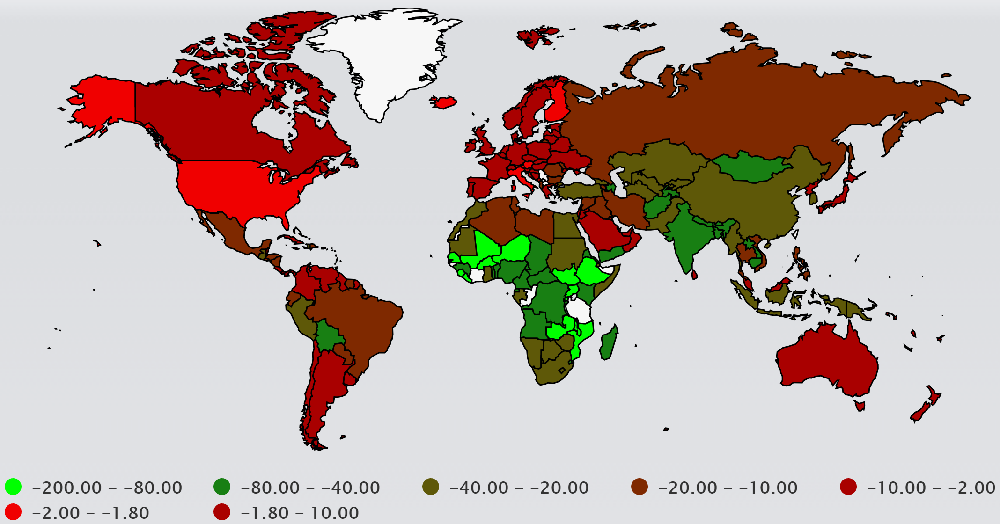
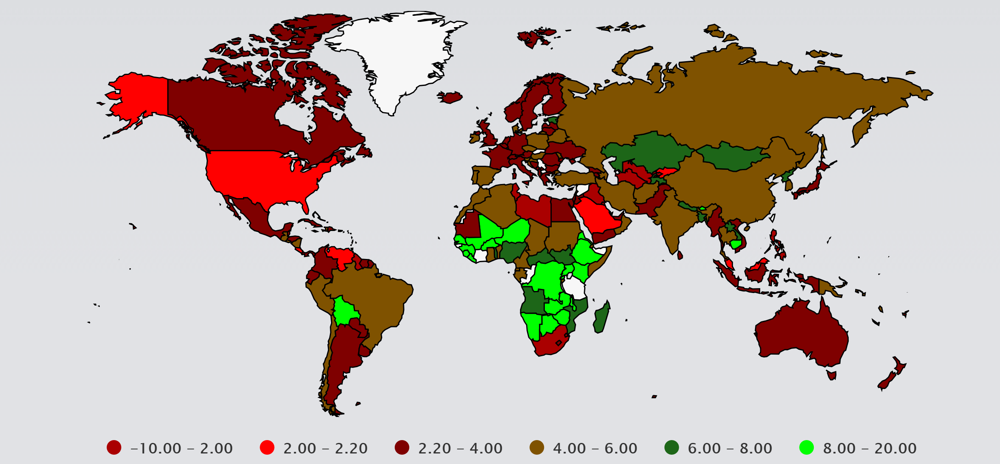

```{r setup, include=FALSE}
library(shiny)
library(dplyr)
library(plotly)
library(ggplot2)
library(highcharter)
library(DT)
knitr::opts_chunk$set(echo=FALSE, message=FALSE)

#data
child_mortality <- read.csv("data/child_mortality.csv", header = TRUE, sep = ",", stringsAsFactors = FALSE)
child_mortality <- mutate(child_mortality, difference_2000_2015 = X2015 - X2000)

life_expectancy <- read.csv("data/life_expectancy.csv", header = TRUE, sep = ",", stringsAsFactors = FALSE)
life_expectancy <- mutate(life_expectancy, diff = X2015 - X2000)

developed_count <- read.csv("data/developed_count.csv", header = TRUE, sep = ",", stringsAsFactors = FALSE)
developed_count <- mutate(developed_count, difference = X2015 - X2000)

source("R/bar_g.R")
source("R/cm_map.R")
source("R/le_map.R")

```
One of the many polarizing issues in the United States is the issue of healthcare. Are people getting the care they need at prices they can afford? Is the current system effective? Or do we need a new system? As current politicians continue the push for universal healthcare while others vehemently stand against it, we decided to look at the data for ourselves. By looking at worldwide data over the past 15 years of changes in child mortality and life expectancy rates, we were able to see the healthcare trends in the United States as well as around the world and see for ourselves if our current system is working. 

## Child Mortality

Over the past 15 years, the United States has had little to no change in child mortality. Infants and children, under the young age of 5-years-old, have been dying, on average, at a rate of 7,612 children per year. _Seven thousand, six hundred twelve children per year_. This rate is simply unacceptable, as from the year 2000 to the year 2015, the rate decreased only by 1,900 children. As seen below, this change among the worst in the _world_. Mortality rate has barely been decreasing for over a decade, further evidence that the United States healthcare system has been failing our children for at least the past 15 years. 



### Change in Child Mortality Rates from 2000 to 2015


## Life Expectancy

Life expectancy is yet another way the United States healthcare system has been failing our children. 

### Change in Life Expectancy in the Top 15 Developed Countries from 2000 to 2015
```{r developed_count, echo=FALSE}
bar_gr(developed_count)
```
This chart shows that the United States has the _lowest_ increase in life expectancy when compared to the other _fourteen most developed countries in the world_. This figure above is a strong piece of evidence that the United States healthcare system is failing, and that socialized healthcare is a much more effective system. 

### Change in Life Expectancy World Wide from 2000 to 2015


This chart expands the lack of effectiveness provided by the United States healthcare system. Over the past 15 years, the United States has had a lower increase in life expectancy than countries such as Mali, Niger, Nambia, Botswana, Zambia, and Kenya, among many others. The evidence is clear: The US healthcare system is not working. 

The data is clear as day. The United States healthcare system is not effective for the general population. Of course the rich can afford to pay for their own doctors, but what about the rest of the people? Over the past 15 years, the United States has had a lower increase in child mortality rate as well as a lower increase in life expectancy as opposed to many countries with socialized healthcare. The evidence speaks for itself: If you want effective healthcare for everybody, socialized medicine is the most effective for all. 
